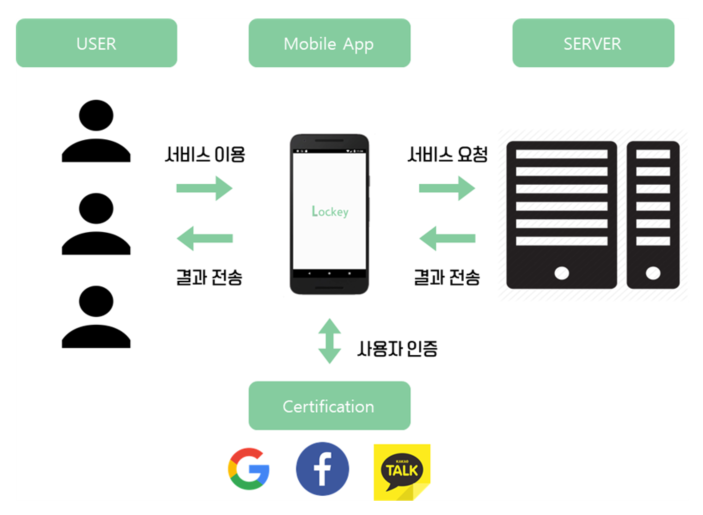
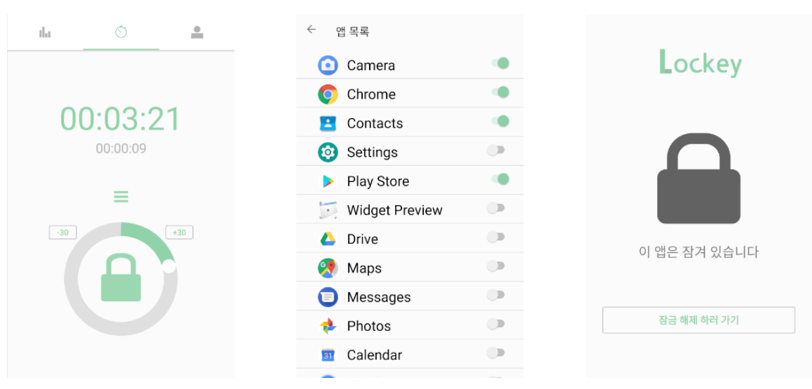
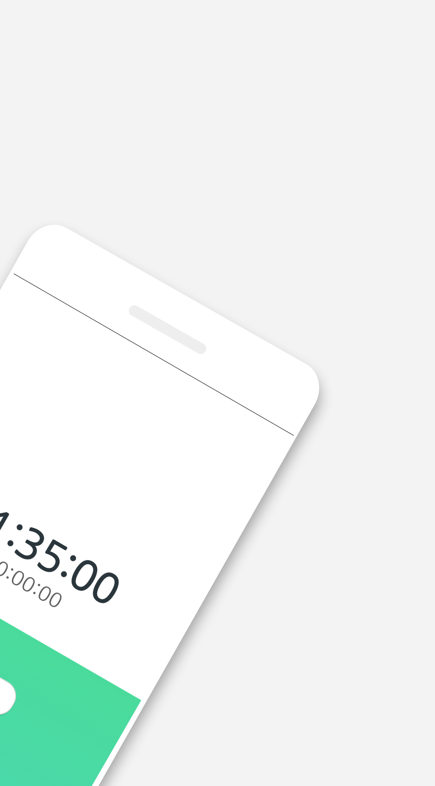
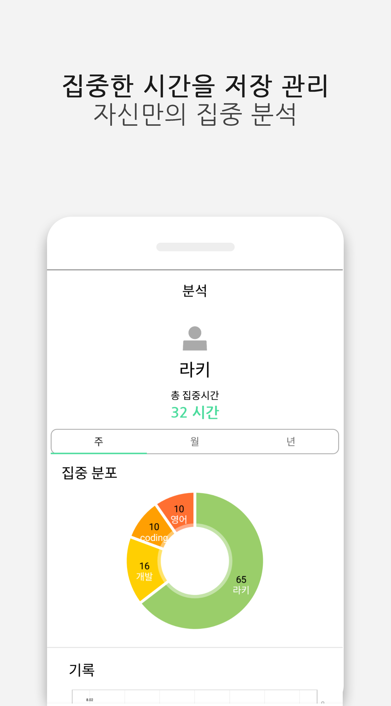
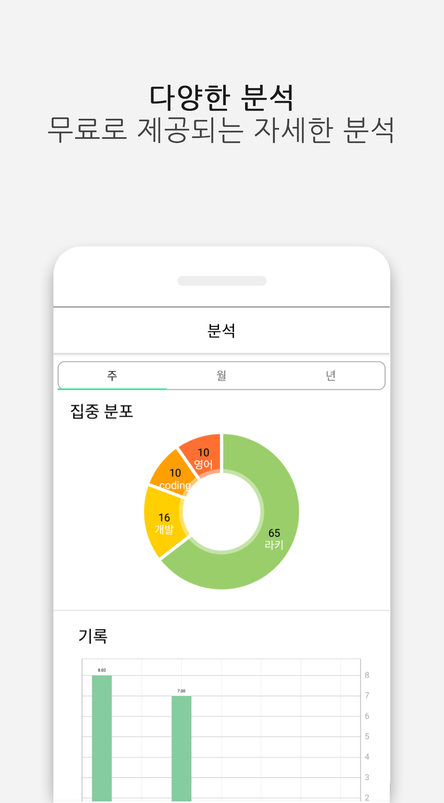
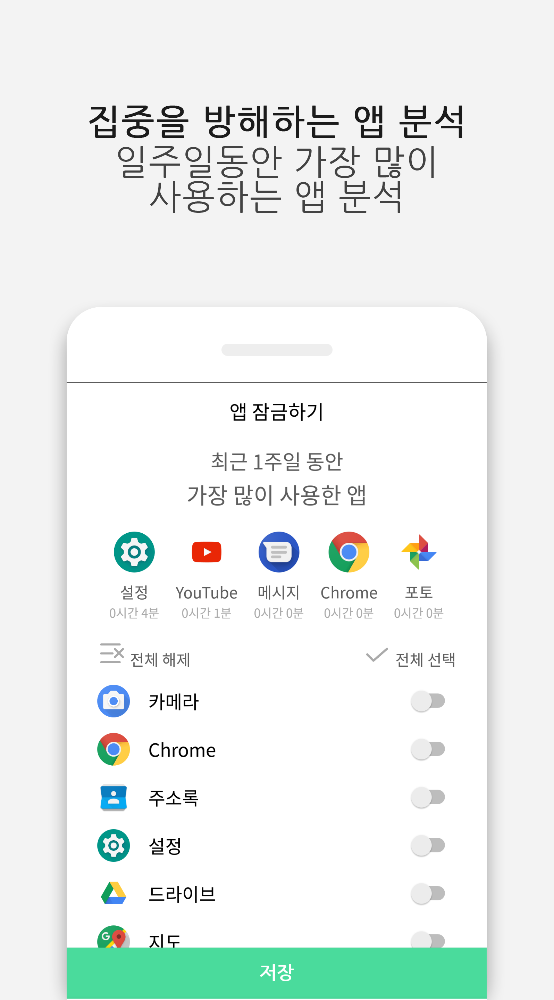
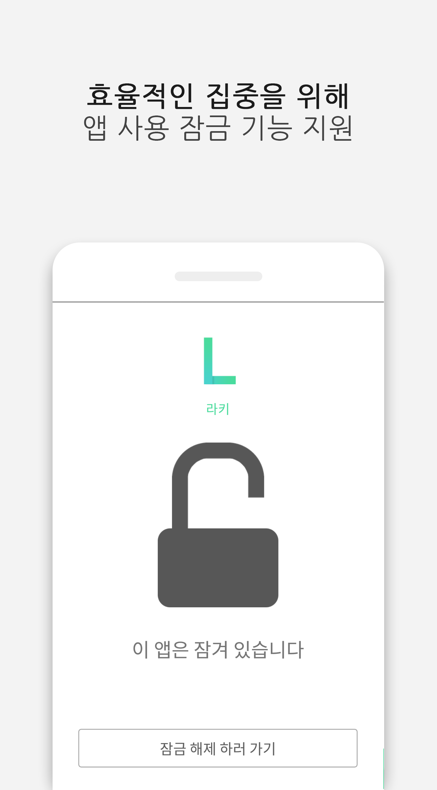

# Study-Time-Management-Application : Lockey

## 1. Project Overview 
+ ### Background 
  * 스마트폰 기술의 발전과 함께 스마트폰 보급률이 꾸준하게 증가하면서 어느덧 대한민국의 스마트폰 보급률은 약 90%에 육박하게 되었다. 
  스마트폰 사용이 생활의 일부분으로 자리 잡으면서 발생한 스마트폰 중독 문제는 어느덧 사회적 문제로 대두되었고, 
  이는 특히 학생 및 수험생 중 자기절제력이 부족한 이들에게 집중력 향상에 큰 장애요소로 작용하고 있다. 
  이에 우리는 스마트폰을 소유하고 있되 뚜렷한 목표의식을 가지고 자신의 시간과 생활을 관리하고 싶은 사람들을 위한 서비스를 구상하게 되었다.

+ ### Project Goal
  - 목표 시간 설정 후 스마트폰을 뒤집어서 사용하지 않을 때만 동작하는 타이머 제공
  - 앱 잠금 기능 제공하여 특정 서비스에 대한 접근 차단
  
## 2. Development environment
+ ### Server
  * Raspberry Pi 3 B+
  * Rasbian
  * RAM : 512MB
  * SD CARD : 32GB
+ ### Client
  * Android 7.0
  * target API Version : 27
  * Compile API Version : 27
  * minSDK version : 21
  
## 3. Language/DB
+ ### Server
  * Python 3
  * MariaDB
+ ### Client
  * Android java
  
## 4. Project Architecture & Design
+ ### Architecture
   
+ ### Design
   
   

## 5. Function Description
+ ### Timer
  * 사용자가 목표시간을 지정 할 수 있습니다.
  * 목표시간을 초과 해도 집중 시간은 저장 되며 목표 달성률을 저장합니다.
  * 타이머는 중앙 하단에 위치한 자물쇠 버튼 혹은 기기를 뒤집으면 바로 시작하게 됩니다.
+ ### App Lock
  * 사용자는 집중에 방해가 되는 앱을 지정하여 사용 잠금 설정 할 수 있습니다.
  * 지정한 앱 접근 시 잠금화면이 뜨며 기능을 제한 합니다.
  * 잠금은 어느 상황에서도 유지 됩니다.
+ ### Analysis
  * 집중 타이머가 끝나면 사용자의 집중 카테고리를 입력 받습니다.
  * 사용자는 그래프를 통해 간편하게 자신의 집중 시간을 일별, 주별, 월별, 집중 카테고리 별로 비교 분석 할 수 있습니다.
  * 기기가 바뀌더라도 정보는 서버에 저장되어 있기에 어디서든 연동 가능 합니다.

## 6. Docs & Video
+ ### Docs
  * [Report](docs/Report.hwp)
  * [PPT](docs/PPT.pdf)
+ ### Video
  * [URL](https://www.youtube.com/watch?v=lm0zOXoS0Ig&feature=youtu.be)
  
## * 현재 라키는 버전 업을 통해 새로운 UI와 기능을 추가하여 출시하였습니다! 
 + ### Differences from Previous Versions
   * 최근 가장 많이 사용 앱 TOP5를 사용한 시간과 함께 보여줍니다.
   * 네이버 계정 연동을 추가하였습니다.
   * 타이머의 SeekBar를 없애고 새로운 UI와 함께 타이머를 설정할 수 있습니다.
   * 회원 정보 변경 기능과 함께 설정 탭을 추가하였습니다.
 + ### Design
   
 + ### Download URL
   * [PlayStore URL](https://play.google.com/store/apps/details?id=com.deadlinestudio.lockey)

